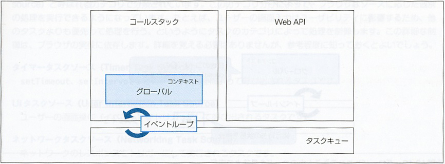
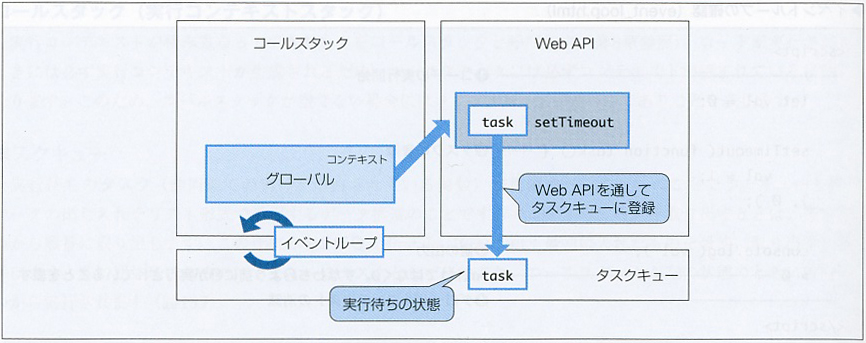
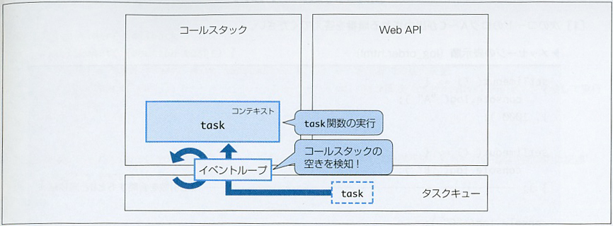

# 非同期処理

### グローバル・コンテキストの生成


### タスク・キューにタスクが登録される


### グローバル・コンテキスト内のコードを最後まで実行


### グローバル・コンテキストの消滅後



メイン・スレッドを上から下へ処理する通常の同期処理。
上から順に実行していく。

例題）
> __スクリーンがリロードされて3秒以内にボタンを押しと『ボタンがクリックされました。』と出力し、3秒経つとコンソールに『sleep関数が完了しました。』と出力されるコードを書きなさい。__

1. sleep()関数を定義する。
  引数に時間を渡して、指定時間が過ぎるとコンソールに『sleep関数が完了しました。』と出力を定義する。
1. ボタンをクリックしたら『ボタンがクリックされました。』とコンソールに出力するclickHandler()関数を定義する。

```js
function sleep(ms) {
  const starTime = new Date();
  while(new Date() - starTime < ms) {}
  console.log("sleep関数が完了しました。");
}

sleep(3000);

const btn = document.querySelector("button");
function clickHandler() {
  console.log("ボタンがクリックされました。");
}
btn.addEventListener("click", clickHandler);
```

`setTimeout`関数の中でコールバック関数を実行することで非同期にしてみる。

```js
function sleep(ms) {
  setTimeout(function() {
    console.log("sleep関数が完了しました。");
  }, ms);
}

sleep(3000); // => ここに置いてあっても。。。

const btn = document.querySelector("button");
function clickHandler() {
  console.log("ボタンがクリックされました。");
}
btn.addEventListener("click", clickHandler);
```

同じ要領でもう一つ。コンソールに0が表示される。

```js
let val = 0;
setTimeout(() => { val = 1 }, 1000);
console.log(val);
```


## 関数が実行される順番
* スレッドから順にコールスタックに入る。
* Web APIを呼び出して非同期処理になるものはタクス・キューに追加された順に入っていく。
* コールスタックが空になったタイミングで、 __タクス・キューの順__ にコールスタックへ入り実行。
__順に入った上__ で、n秒待つものはn秒待ってから、0秒のものは0秒待ってから実行される。
* ここがポイントで、コールスタックへ各タスクが入って、__各タスク内で定義されているコールバック関数を前から順にほぼ瞬間で処理する（人間の感覚的に同時に実行する。）。__　だからこそ、各タスクに設定した待ち（延滞）時間が影響するわけ。
* そこでこの待ち（延滞）時間をコントロールするための仕組みが作ってある。後述。
```js
setTimeout(() => { console.log("A"); }, 1000);
setTimeout(() => { console.log("B"); }, 0);
console.log("C");
```

__答え => C -> B -> A の順で実行される。__


## 非同期処理の取り扱い

> * 非同期処理は、コール・スタックに積み上がっている実行コンテキストが全て終了した後に実行される。
> * そのため、非同期処理で処理した __『値』__ を取得しててからなんらかの処理を行うには注意が必要。

例題）

グローバルで定義してある値を非同期処理によって1秒後にランダムな値に変える。
現状では、コール・スタックにあるグローバル・コンテキストが実行されてしまい変数の値は変更されない。

```js
let val = -100;

const timer = () => {
  setTimeout(() => {
    val = Math.floor(Math.random() * 11);
  }, 1000);
};
// グローバルで定義してある値を1秒後にランダムな値に変える。
timer();
// 現状では、
// コール・スタックにあるグローバル・コンテキストが実行される。
console.log(val);
```

なので、
コール・スタックにあるグローバル・コンテキストが実行を一旦、関数に定義する。
その関数を非同期処理をする関数の引数（コールバック関数）としてとり、非同期関数のコールバック関数の中で処理する。

```js
let val = -100;

const timer = (cb) => {
  setTimeout(() => {
    val = Math.floor(Math.random() * 11);
    // コールバック関数を実行
    cb(val);
  }, 1000);
};
// コールバック関数を定義
const handler = (val) => {
  console.log(val);
};
// 非同期処理を仕込んだ関数にコールバック関数として渡す。
timer(handler);

```


例題）

> * delay()関数を定義して、1秒後に「こんにちは」とコンソールに表示。
  2秒後に「さようなら」とアラートに表示するコードを書く。
> * このコードで確認したいことは、コール・スタックに実行コンテキストが無いことをイベント・ループが検知して、実行待ちのタスク関数をタスク・キューから取得、実行する際に、何も指示をしないと待機していたタスクは、ほぼ同時にスタート地点に立つということ。タスクに仕込んである非同期関数の待機時間の順に関数は処理されて行くこと。
> * 『さようなら』を0秒にすれば言っていることを理解できる。

* delay関数を使って表現する。
  関数の引数に『関数』『メッセージ』『時間』をとり、関数へはコンソールかアラート表示の関数を呼び出して作動させる。

> 見たまま考える。
> 
> 引数には、
> 1. コールバック関数  => console.log, alert
> 1. メッセージ       => "こんにちは", "さようなら"
> 1. 待機時間         => 1000, 2000

```js
function delay(fn, msg, ms) {
  setTimeout(function() {
    fn(msg);
  }, ms);
}

delay(console.log, "こんにちは", 1000);
delay(alert, "さようなら", 2000);
```

---

例題）

> * 先の __2つの関数の実行__ を __一つにまとめる__ 。
> ここで確認することは、非同期関数を順番に処理するには、非同期関数のネストしないとできないということ。

* 非同期処理のネストを書く。 
  delay関数をネストして呼び出し、つまり、delay関数の中で無名関数をネストすればいい。
  取り回したい変数（この場合メッセージ）は、無名関数の引数にする。

```js
delay((msg) => {
  console.log(msg);
  delay((msg) => {
    console.log(msg);
  }, "さらに、1秒経ちました。", 1000);
}, "1秒経ちました。", 1000);
```

## Promise

Promiseは、`非同期処理を扱うオブジェクト`。
非同期処理に`ネスト`が深くなることを避けることができる。

### 1. Promiseの記述

* Promiseは初期状態で、`resolve`, `reject`という関数を持つ。
* `resolve関数`は`then`メソッドがある。
* `reject関数`は`catch`メソッドがある。
* `resolve`, `reject`の引数は、それぞれ`then`メソッド, `catch`メソッドに渡っていく。

#### まずは、以前にやったコードをエラー処理も含めて書き換えてみる。

> 1秒後に「こんにちは」とコンソールに表示。
  2秒後に「さようなら」とアラートに表示するコードをコードを書きさコードを書く。

```js
const delay = (func, msg, ms) => {
  return ins = new Promise((resolve, reject) => {
    setTimeout(() => {
      func(msg);
      if (typeof func !== "function" 
              || msg === "" 
              || typeof ms !== "number") {
        reject("引数に間違いがあります。");
      } else {
        resolve();
      }
    }, ms)
  });
};

delay(console.log, "hello", 1000)
  .then(() => {
    return delay(console.log, "bye", 1000);
  })
  .then(() => {
    return delay(alert, "はーい", 1000);
  })
  .catch((error) => {
    console.error("エラーが発生：", error);
  })
  .finally(() => {
    console.log("処理の終了");
  });
```
復習がてらにやってみた。
__複雑になるネストを回避し、コードの可読性を上げることができた。__

例）

> では、改めてPromiseで非同期処理を書く。
> * `Promise`の`コールバック関数`の`中に仕込む非同期関数`をインスタンス化する。
> * そのインスタンスを`then()関数`・`catch()関数`・`finally()関数`で呼んでやって（発火させて）処理をするというもの。

ランダムに整数を生成させて、5以上であれば成功、未満であればエラーを、処理が終わったら終了させるというコードを書いてみる。

* 仮でインスタンスを作る。
* then, catch, finallyの流れでインスタンスを呼ぶ。
* とりあえず形を作る。
  
```js
let ins = new Promise((resolve, reject) => {});

ins.then((varlue) => {})
  .cathc((error) => { "エラー発生:", error })
  .finally(console.log("処理終了"));
```

コールバック関数に非同期処理を書く。


```js
// その1
let instance = new Promise((resolve, reject) => {
  setTimeout(() => {
    // 0から10までの整数をランダムに生成させる。
    const rand = Math.floor(Math.random() * 11);
    if (rand < 5) {
      reject(rand);
    } else {
      resolve(rand);
    }
  }, 1000)
});

instance = instance.then((value) => {
  console.log(`5以上の値${value}が渡ってきました。`);
});

instance = instance.catch((errorValue) => {
  console.log(`5未満の値${errorValue}が渡ってきたのでエラー表示。`);
});

instance = instance.finally(() => {
  console.log("処理を終了します。");
});
```

これを雛形にして、ランダムに整数を生成させて、
偶数なら成功、奇数ならエラーを、処理が終わったら終了させるコードを書く。

```js
// その2
let instance = new Promise((resolve, reject) => {
  setTimeout(() => {
    // 0から10までの整数をランダムに生成させる。
    const setTime = new Date().getSeconds();
    console.log(setTime);
    // こういう考え方はしない。
    // if (setTime % 2 === 0) {
    // 2で割ったあまりが『有れば』真で、reject行き。
    // それ以外は偶数だからresolve行きになると考える。
    if (setTime % 2) {
      reject(setTime);
    } else {
      resolve(setTime);
    }
  }, 1000)
});


instance = instance.then((value) => {
  console.log(`${value}は、偶数のため成功とします。`);
});

instance = instance.catch((errorValue) => {
  console.log(`${errorValue}は、奇数のためエラーとします。`);
});

instance = instance.finally(() => {
  console.log("処理を終了します。");
});
```


## 2. Promiseチェーン

Promiseチェーンで先ほどのコードを書き直してみる。
returnでしっかり返さないと上手く動かない点に注意。

```js
// その1
let ins = new Promise((resolve, reject) => {
  setTimeout(() => {
    const val = Math.floor(Math.random() * 11);
    if (val < 5) {
      reject(val);
    } else {
      resolve(val);
    }
  }, 1000);
});

ins.then((value) => {
    return console.log(`ランダムに生成された数字は、${ value }です。`);
  })
  .catch((error) => { 
    return console.log(`今回、ランダムに生成された数字${ error }は、設定した値より小さいです。`) 
  })
  .finally(() => { console.log("処理終了") });


// その2
let ins = new Promise((resolve, reject) => {
  setTimeout(() => {
    const getSec = new Date().getSeconds();
    if (getSec % 2) {
      reject(getSec);
    } else {
      resolve(getSec);
    }
  }, 1000);
});

ins.then((value) => {
    return console.log(`${ value }秒は偶数なので成功とします。`);
  })
  .catch((error) => { 
    return console.log(`${ error }秒は奇数なのでエラーとします。`) 
  })
  .finally(() => { console.log("処理終了") });

  
```

__retrunを書かない場合は一行で書くこと。じゃないと上手く動かないからね。__

```js
instance = instance
  .then(value => console.log(`${value}は、偶数のため成功とします。`))
  .catch(errorValue => console.log(`${errorValue}は、奇数のためエラーとします。`))
  .finally(() => console.log("処理を終了します。"));
```

---

> では、1秒ごとに2つずつ数値がインクルメントされてコンソールに表示されるプログラムをプロミス・チェーンを使って書く。

```js
// インスタンスか関数にPromiseを持たせる。

const incrementNum = (number) => {
  return new Promise((resolve, reject) => {
    setTimeout(() => {
      // 単純に考える。
      // 出力してからインクリメント演算子かけたら
      // 結果は０から始まり、
      // 回を重ねるごとに値はインクリメントされる。
      console.log(number);
      number += 2;
      if (number > 6) {
        reject(number);
      } else {
        resolve(number);
      }
    }, 1000);
  });
};

incrementNum(0)
  .then((num) => { return incrementNum(num) })
  .then((num) => { return incrementNum(num) })
  .then((num) => { return incrementNum(num) })
  .then((num) => { return incrementNum(num) })
  .then((num) => { return incrementNum(num) })
  .then((num) => { return incrementNum(num) })
  .catch((error) => { console.log(`エラーの理由：${ error }`)})
  .finally(() => { console.log("処理の終了")});
```

### Promiseの管理状態

#### Promiseのステータス一覧

ステータス|説明|
|---:|---|
|pending|resolve, rejectが『呼び出される前』の状態|
|fillfilled|resolveが『呼び出された状態』|
|rejected|rejectが『呼び出された状態』|
|settled|fillfilled、または、rejected|

__状態の確認方法__

```js
// 初期値にundefinedを値として初期化
let promResolve, promReject;

const prom = new Promise((resolve, reject) => {
  promResolve = resolve;
  promReject = reject;
});

// 状態は、pending
console.log(prom);
//=> Promise {<pending>}

// とても不思議なコード。
// とりあえずこれでPromiseを実行させているそうだ。
promResolve("hello");

// 状態は、fullfilledとなる。
console.log(prom);
//=> Promise {<fulfilled>: 'hello'}
```


### Promiseを使った並列処理

#### Promise.all

__全て__ の非同期処理を __並列に実行__ し、 __全て__ の __完了__ を待ってから __次の処理__ を行う。

__構文__

> Promise.all(_**iterablePromises**_)
> 　.then((_**resolveArray**_) => { ... })
> 　.catch((_**error**_) => { ... })

__実行イメージ__

__（私の中のイメージ）基本的には横一線に並ばせて全て処理する。全ての『fulfilled』を待機時間の順に実行する。『rejected』があれば待機時間に従って処理を中止し、『catch』へ処理を進める。__

> Promise.all([_**fulfilled**_, _**fulfilled**_, _**fulfilled**_]); => thenメソッドの実行
> Promise.all([_**fulfilled**_, _**rejected**_, _**fulfilled**_]); => catchメソッドの実行

例）
引数に値を入れて、非同期関数のコールバックで色々処理して
__結果を同時に出力できるということかな？__
とりあえず、そう理解しておく。

```js
// Promise.all
// 最初にやったサンプルのように、関数を一行ずつ実行するような状態を再現できる。
// コール・スタックにグローバル・コンテキストが無くなるのをイベント・ループは検知して、
// タスク・キューにあるタスクを順に実行していく。
// ほぼ瞬時に入るので関数は一斉に発火し、延滞時間によって実行がコントロールされるように見えるわけだ。
// 延滞時間とメッセージを引数に持たせた関数をPromise.allで実行する。

const wait = (ms, message) => {
  return new Promise((resolve, reject) => {
    setTimeout(() => {
      console.log(`${ ms }秒後にメッセージ：${ message }を出力する。`);
      if (typeof ms !== "number" || typeof message !== "string" || message === "") {
        reject([ms, message]);
      } else { 
        resolve([ms, message]);
      }
    }, ms);
  });
};

Promise.all([wait(1000, "hello"), wait("hoge", "bye"), wait(2000, "はい")])
  // つまり、ここのthen関数はおまけ。なくてもいいんです。
  .then(([resolved1, resolved2, resolved3]) => {
    console.log("全てのPromiseが完了しました。");
    console.log(resolved1[0], resolved1[1], 
                resolved2[0], resolved2[1], 
                resolved3[0], resolved3[1]);
  })
  .catch(([err1, err2, err3]) => {
    console.log(`error: ${err1}, ${err2}, ${err3}`);
    console.log("一部の処理が不十分です。");
  });
```

#### Promise.race

__実行イメージ__

__（私の中のイメージ）待機時間最短で『fulfilled』または、『rejected』を抽出し、『then』または『catch』へ処理を進める。__

複数の `Promise` インスタンスのいずれかが状態が`settled（fulfilledまたはrejected）`になったときに、Promise.raceに続くthenメソッドまたはchatchメソッドを実行する。
どちらが先に呼ばれるかは、非同期関数で設定した時間による。
__要は、コール・スタックに同時に入ってから、延滞時間が一番短い非同期関数が時効されて処理は終了するということ。__

> Promise.race([_pending_, _pending_, _**fulfilled**_]); => thenメソッドの実行
> 　　　　　　　　　　または、
> Promise.race([_pending_, _**rejected**_, _pending_]); => catchメソッドの実行

__構文__

> Promise.race(_**iterablePromises**_)
> 　.then((_**firstResolveValue**_) => { ... })
> 　.catch((_**error**_) => { ... })

例）

```javascript
// resolve, rejectに渡す引数をPromise.race()の引数に渡す。
const myResolve = new Promise(resolve => {
  setTimeout(() => {
    resolve("resolveが呼ばれました。");
    console.log("myResolveの実行が終了しました。");
  }, 300);
});

const myReject = new Promise((_, reject) => {
  setTimeout(() => {
    reject("rejectが実行されました。");
    console.log("myRejectが実行が終了しました。");
  }, 200);
});

// Promise.race()にmyResolve, myRejectを配列にして引数として渡し、
// この時点で配列内の関数は実行される。
Promise.race([myResolve, myReject])
// どちらか先にsettledした時点でthenまたはcatchのメソッドが実行される。
  .then(value => {
    console.log(value);
  })
  .catch(value => {
    console.log(value);
  })
// この場合は、
// myResolve => 300ms後実行
// myReject =>  200ms後実行
// なので、myRejectが先にsettledになる。
// any()関数のように他の非同期関数の処理を待つことなく、
// catchメソッドを実行して処理は終了する。

//=> myRejectが実行が終了しました。
//=> rejectが実行されました。
//=> myResolveの実行が終了しました。
```

#### Promise.any

__実行イメージ__

__（私の中のイメージ）待機時間最短で『fulfilled』が実行され、『then』へ処理を進める。全ての非同期処理が『reject』の場合には『catch』へ処理を進める。__

複数の`Promiseインスタンス`のいずれかが`fulfilled`になった時点で`thenメソッド`に処理を移す。
また、全てのインスタンスの状態が`rejected`になった時に、`catchメソッド`を実行する。

> Promise.race([_rejected_, _rejected_, _**fulfilled**_]); => thenメソッドの実行
> Promise.race([_rejected_, _rejected_, _rejected_]); => catchメソッドの実行

__構文__

> Promise.race(_**iterablePromises**_)
> 　.then((_**resolveValue**_) => { ... })
> 　.catch((_**error**_) => { ... })

例）

```javascript
const myResolve = new Promise(resolve => {
  setTimeout(() => {
    resolve("resolve関数が呼ばれました。");
    console.log("myResolveの処理が終了しました。");
  }, 200);
});

const myReject = new Promise((_, reject) => {
  setTimeout(() => {
    reject("reject関数が呼ばれました。");
    console.log("myRejectの処理が終了しました。");
  }, 100);
});

// myRejectは、100ms後に処理が行われて結果はrejectなんだけど、
// 他の非同期関数の結果を待つ。ここ重要。
// その後、myResolveが実行され結果は、fulfilledなので
// この関数に関わるthenメソッドが実行される。

Promise.any([myResolve, myReject])
  .then(value => {
    console.log(value);
  })
  .catch(value => {
    console.log(value)
  })

//=> myRejectの処理が終了しました。
//=> myResolveの処理が終了しました。
//=> resolve関数が呼ばれました。
```


#### Promise.allSettled

__実行イメージ__

__（私の中のイメージ）待機時間最短で『fulfilled』が実行され、『then』へ処理を進める。__

全ての`Promiseインスタンス`の状態が`settled`（`fulfilled`または`rejected`）になった時点で`thenメソッド`に処理を移す。

> Promise.race([_**fulfilled**_, _rejected_, _**fulfilled**_]); => thenメソッドの実行

__構文__

> Promise.race(_**iterablePromises**_)
> 　.then((_**any**_) => { ... })

例）

```javascript
const myResolve = new Promise(resolve => {
  setTimeout(() => {
    resolve("resolveが呼ばれました。");
    console.log("myResolveの実行が終了しました。");
  }, 200);
});

const myReject = new Promise((_, reject) => {
  setTimeout(() => {
    reject("rejectが呼ばれました。");
    console.log("myRejectの実行が終了しました。");
  }, 100);
});

// myResolve, myRejectの状態がsettledになるまで、後続の処理（then）を待機する。
// fulfilled => valueプロパティにresolveの引数が渡る。
// rejected => reasonプロパティにrejectの引数が渡る。

Promise.allSettled([myResolve, myReject])
  // 引数の配列はわざわざ初期化などせずともいきなり置ける。便利。
  .then(arr => {
    for(const { status, value, reason } of arr) {
      console.log(`ステータス：${ status }, 値：${ value }, エラー：${ reason }`);
    }
  })

// myRejectの実行が終了しました。
// myResolveの実行が終了しました。
// ステータス：fulfilled, 値：resolveが呼ばれました。, エラー：undefined
// ステータス：rejected, 値：undefined, エラー：rejectが呼ばれました。
```

#### その他の静的メソッド

特定の処理を非同期処理として実行したい場合に使える。
ちなみに、reject()関数はほぼ使わない。

```js
let val = 0;
// 非同期に設定する。その1 resolve()
Promise.resolve().then(() => {
  console.log(`非同期では、valの値は${ val }です。`);
})
// グローバル・スコープで関数の実行。
console.log(`グローバル・コンテキストの終了。ちなみに変数valの値は、${ val }です。`);
// 変数の更新。
val = 1;


// 非同期に設定する。その2 reject()
Promise.reject("エラーの理由").catch(error => {
  console.error(error);
})
// グローバル・スコープで関数の実行。
console.log("グローバル・コンテキストの終了。");

//=> グローバル・コンテキストの終了。ちなみに変数valの値は、0です。
//=> グローバル・コンテキストの終了。
//=> 非同期では、valの値は1です。
//=> エラーの理由
```

#### 実行される順番

A、Eのみ同期的に実行されるため、まずA → Eの順でログが表示されます。
次に、Dはジョブキュー、Cはタスクキューなので、Dのジョブから実行されます。
その後、setTimeoutのコールバック関数が実行されますが、
Bはジョブキューに登録されるので、さらに非同期で実行されます。
そのため、Cの実行が同期的に行われてから、Bが実行されます。

```js
console.log("A");

setTimeout(() => {
  queueMicrotask(() => console.log("B"));
  console.log("C");
});

Promise.resolve().then(() => console.log("D"));

console.log("E");

// A -> E -> D -> C -> B
```

__3人でバトンをつないでリレーする__

```js
// Q1
function run(personName) {
  return new Promise((resolve, reject) => {
    const time = Math.floor(Math.random() * 11);
    setTimeout(() => {
      if (time % 4 === 0) {
        // データ型をどうするかは、リテラルによって決める。
        // ここでは連想配列リテラルで送っている。
        // ここの中身はそれぞれ『キー』であると認識しておく。
        reject({ personName });
      } else {
        resolve({ personName, time });
      }
    }, time);
  });
}

// Promiseチェーンの直列

// 引数を与えてPromiseの最初のインスタント生成する。
// resolveから渡ってきた引数を展開する。つまりthen関数のコール・バック関数を実行する。
// 次のインスタンスを生成させる。実行、生成の繰り返し。

// then関数で繋いでいく過程で、それぞれに独自の出力である必要で無いなら
// 関数化するのがベターなので参考として書く。
const printResult = ({ personName, time }) => {
  console.log(`${ personName }が、${ time }秒でゴール！`);
};

run("太郎")
.then((result) => {
  printResult(result);
// こういう書き方が面倒なら関数にして呼び出す。
// .then(({ personName, time }) => {
//   console.log(`${ personName }が、${ time }秒でゴール！`);
  return run("次郎");
})
.then((result) => {
  printResult(result);
// .then(({ personName, time }) => {
//   console.log(`${ personName }が、${ time }秒でゴール！`);
  return run("三郎");
})
.then((result) => {
  printResult(result);
// .then(({ personName, time }) => {
//   console.log(`${ personName }が、${ time }秒でゴール！`);
})
.catch(({ personName }) => {
  console.error(`${ personName }が転倒しました！　レースのやり直しです。`)
});
```

__最初にゴールした人の名前とタイムをコンソールに表示__

```js
// Q2
function run(personName) {
  return new Promise((resolve, reject) => {
    const time = Math.floor(Math.random() * 11);
    setTimeout(() => {
      if (time % 4 === 0) {
        reject({ personName });
      } else {
        resolve({ personName, time });
      }
    }, time);
  });
}

// 反対に、関数化しても行数が増えるだけならこの形式でやる。
// つまり、臨機応変に対応できないといけないということ。
Promise.any([run("太郎"), run("次郎"), run("三郎")])
  .then(({ personName, time }) => {
    console.log(`${ personName }が、${ time }秒でゴール！`)})
  .catch(() => {
    console.error("レースのやり直しです。")});
```

__全員がゴールしたときにそれぞれの名前とタイムをコンソールに表示__

```js
// Q3
function run(personName) {
  return new Promise((resolve, reject) => {
    const time = Math.floor(Math.random() * 11);
    setTimeout(() => {
      if (time % 4 === 0) {
        reject({ personName });
      } else {
        resolve({ personName, time });
      }
    }, time);
  });
}

Promise.all([run("太郎"), run("次郎"), run("三郎")])
  .then((results) => {
    for(const { personName, time } of results) {
      console.log(`${ personName }のタイムは、${ time }秒です。`);
    }
  })
  .catch(({ personName }) => {
    console.error(`${ personName }が転けました。レースのやり直しです。`)});
```

__全員がゴールまたはコケた際にそれぞれがゴールしたか、コケたかコンソールに表示__

```js
// Q4
function run(personName) {
  return new Promise((resolve, reject) => {
    const time = Math.floor(Math.random() * 11);
    setTimeout(() => {
      if (time % 4 === 0) {
        reject({ personName });
      } else {
        resolve({ personName, time });
      }
    }, time);
  });
}

// status, value, reasonの使い分けを意識できないとallSettledは覚えられないよ。
Promise.allSettled([run("太郎"), run("次郎"), run("三郎")])
  .then((result) => {
    for(const { status, value, reason } of result) {
      if (status === "fulfilled") {
        console.log(`${ value.personName }が${ value.time }秒でゴールしました。`);
      } else {
        console.error(`${ reason.personName }が転けました。`);
      }
    }
  });
```

__誰かがゴールまたはコケたときにその人の名前をコンソールに表示__

```js
// Q5
function run(personName) {
  return new Promise((resolve, reject) => {
    const time = Math.floor(Math.random() * 11);
    setTimeout(() => {
      if (time % 4 === 0) {
        reject({ personName });
      } else {
        resolve({ personName, time });
      }
    }, time);
  });
}

Promise.race([run("太郎"), run("次郎"), run("三郎")])
  .then(({ personName, time }) => {
    console.log(`${ personName }が、${ time }秒でゴール！`)})
  .catch(({ personName }) => {
    console.error(`${ personName }が転びました。`)});
```